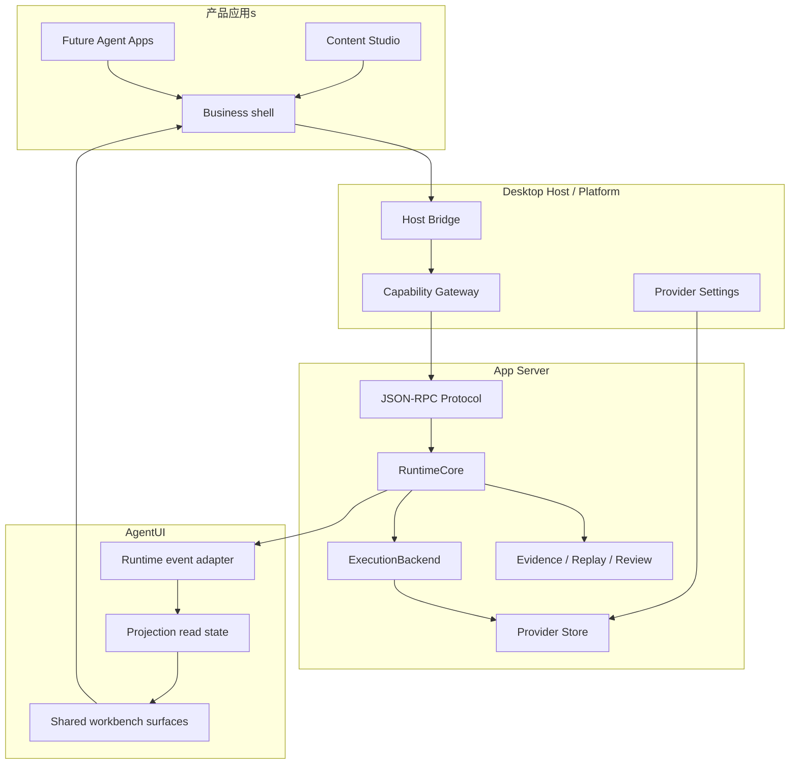

# 架构

Lime 的架构重点不是“前端连一个 agent endpoint”，而是让所有 Agent Apps 共享同一套 runtime facts 和 UI 投影。

## 组件职责

| 组件 | 职责 |
| --- | --- |
| 产品应用 | 业务上下文、业务动作、页面编排。 |
| Desktop Host | sidecar lifecycle、Host Snapshot、capability dispatch、IPC。 |
| App Server JSON-RPC | current runtime API 与 read API。 |
| RuntimeCore | session/thread/turn/task/run/action/event/read model truth。 |
| ExecutionBackend | 模型、工具、命令、子代理、远程通道 adapter。 |
| Provider Store | Provider metadata/key 的唯一事实源。 |
| AgentUI Adapter | 把 runtime facts 归一化为 投影 events。 |
| AgentUI Surfaces | 消息、过程、工具、审批、产物、证据、诊断、团队工作台。 |

## 所有权 rule

UI 可以渲染事实、聚合事实、折叠事实，但不能写入 runtime truth。用户动作必须回到拥有方 API：

- turn/cancel/resume -> RuntimeCore。
- approval/input -> action owner。
- artifact edit/export -> artifact service。
- evidence export/review -> evidence service。
- Provider settings -> platform/App Server Provider store。

## 传输规则

传输层可以是 Electron IPC、stdio JSON-RPC、HTTP SSE、WebSocket 或 future remote channel。传输不是标准核心。标准核心是 event envelope、read models、投影 mapping 和 ownership。
