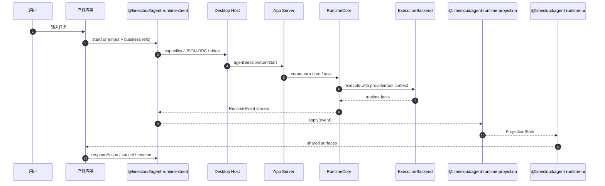

# 架构

Lime 的架构重点不是“前端连一个 agent endpoint”，而是让所有 Agent Apps 共享同一套 runtime facts 和 UI 投影。

```mermaid
flowchart TB
  subgraph Product[产品应用s]
    CS[Content Studio]
    Apps[Future Agent Apps]
    UI[Business shell]
  end

  subgraph Host[Desktop Host / Platform]
    Bridge[Host Bridge]
    Gateway[Capability Gateway]
    Settings[Provider Settings]
  end

  subgraph Server[App Server]
    RPC[JSON-RPC Protocol]
    Core[RuntimeCore]
    Backend[ExecutionBackend]
    Provider[Provider Store]
    Evidence[Evidence / Replay / Review]
  end

  subgraph SDK[Agent SDK Line]
    Contracts[@limecloud/agent-ui-contracts]
    ProjectionPkg[@limecloud/agent-runtime-projection]
    ReactPkg[@limecloud/agent-runtime-ui]
    RuntimeClient[@limecloud/agent-runtime-client]
  end

  subgraph Projection[AgentUI]
    Adapter[Runtime event adapter]
    Parts[UIMessageParts]
    Timeline[ProcessTimeline]
    Graph[ExecutionGraph]
    Surfaces[Shared workbench surfaces]
  end

  CS --> UI
  Apps --> UI
  UI --> ReactPkg
  ReactPkg --> ProjectionPkg
  ProjectionPkg --> Contracts
  RuntimeClient --> Contracts
  UI --> RuntimeClient
  RuntimeClient --> Bridge
  Bridge --> Gateway
  Gateway --> RPC
  Settings --> Provider
  RPC --> Core
  Core --> Backend
  Backend --> Provider
  Core --> Evidence
  Core --> Adapter
  Adapter --> ProjectionPkg
  ProjectionPkg --> Parts
  ProjectionPkg --> Timeline
  ProjectionPkg --> Graph
  Parts --> Surfaces
  Timeline --> Surfaces
  Graph --> Surfaces
  Surfaces --> UI
```

## 标准事实源

| 层 | current 事实源 | 不应继续扩展 |
| --- | --- | --- |
| Runtime API | App Server JSON-RPC + RuntimeCore read APIs | legacy desktop facade、产品应用本地 runtime DB。 |
| 执行事实 | RuntimeEvent、ThreadReadModel、TaskSnapshot、ArtifactSummary、EvidenceSummary | assistant prose、日志缩进、本地 `executionEvents` 文本。 |
| UI 投影 | `UIMessageParts`、`ProcessTimeline`、`ExecutionGraph`、ToolGroup、ActionRequired | 非标准组件树协议、模块本地过程模型。 |
| React 表面 | 共享 AgentUI components 和产品样式适配 | 每个 App 复制一套过程组件。 |

## Runtime 参考层

Lime 底层 AgentRuntime 可以参考本地 Rust 执行型 runtime 的执行模型，但参考层不能越过 Lime current 事实源。

| 参考能力 | Lime current 落点 | 架构要求 |
| --- | --- | --- |
| Submission Queue / Event Queue | App Server JSON-RPC + RuntimeEvent stream | 输入和输出解耦，event 可重放、可水合。 |
| Session / Turn / TurnItem | RuntimeCore session/thread/turn/task/run | 外部 item 只能映射为 Lime facts。 |
| Tool executor / MCP tool | ExecutionBackend + Tool inventory | 工具生命周期必须产生 `tool.*` facts。 |
| Exec policy / approvals / guardian | Policy service + ActionRequired | 权限提升必须走 `action.*` / `permission.*`。 |
| Sandbox / permission profile | Desktop Host policy + App Server policy | 文件、网络、命令权限必须可解释、可拒绝。 |
| Context compaction / history | RuntimeCore read model + `history.*` events | 历史压缩必须可恢复，不由 UI 拼 prompt。 |
| App-server protocol fixtures | Lime contracts + conformance | schema、fixture、replay 是标准的一部分。 |

底层执行型 runtime 参考的是运行时品类能力；Lime 标准仍以 App Server、RuntimeCore、ExecutionBackend、AgentUI Projection 为唯一演进主链。

## 组件职责

| 组件 | 职责 |
| --- | --- |
| 产品应用 | 业务上下文、业务动作、页面编排。 |
| Desktop Host | sidecar lifecycle、Host Snapshot、capability dispatch、IPC。 |
| App Server JSON-RPC | current runtime API 与 read API。 |
| RuntimeCore | session/thread/turn/task/run/action/event/read model truth。 |
| ExecutionBackend | 模型、工具、命令、子代理、远程通道 adapter。 |
| Provider Store | Provider metadata/key 的唯一事实源。 |
| AgentUI Projection | 把 runtime facts 归一化为 `UIMessageParts`、`ProcessTimeline`、`ExecutionGraph` 和 surface state。 |
| AgentUI Surfaces | 消息、过程、工具、审批、产物、证据、诊断、团队工作台。 |
| Agent SDK Line | 用四个包拆清 contracts、projection、React surface、runtime transport，不把 runtime client 塞进 UI 包。 |

## 端到端数据流



这条链路里只有 RuntimeCore 和 owner services 写事实。产品应用、React 组件和 projection reducer 都只消费事实或提交 intent。

## TypeScript 包边界

| 包 | 分类 | 职责 |
| --- | --- | --- |
| `@limecloud/agent-ui-contracts` | `current` | RuntimeEvent、read model、projection state、fixture 和 schema 类型。 |
| `@limecloud/agent-runtime-projection` | `current` | projector、fixture replay、App Server facts adapter、UIMessageParts / ProcessTimeline / ExecutionGraph 投影。 |
| `@limecloud/agent-runtime-ui` | `current` | React projection view、消息/过程/执行图/审批/团队工作台共享表面。 |
| `@limecloud/agent-runtime-client` | `current` | App Server JSON-RPC client、event subscription、read APIs、evidence export。 |
| `@limecloud/agent-ui` | `future facade` | 未来可选 re-export UI contracts/projection/runtime-ui；不承载真实实现，不包含 runtime transport。 |

四包产品线是统一标准，不是统一成一个物理包。这样可以让产品应用只依赖 React 表面，测试和 CLI 只依赖 contracts/projection，runtime 集成只依赖 runtime client。

## 包依赖方向

```text
@limecloud/agent-runtime-ui
  -> @limecloud/agent-runtime-projection
  -> @limecloud/agent-ui-contracts

@limecloud/agent-runtime-client
  -> @limecloud/agent-ui-contracts

@limecloud/agent-ui
  -> @limecloud/agent-runtime-ui
  -> @limecloud/agent-runtime-projection
  -> @limecloud/agent-ui-contracts
```

禁止方向：

- `agent-ui-contracts` 依赖 React、App Server client 或产品应用。
- `agent-runtime-projection` 依赖 React DOM、Electron、Provider SDK。
- `agent-runtime-ui` 直接调用 Provider 或读 App Server DB。
- `agent-runtime-client` 生成 UI projection state。

## 所有权 rule

UI 可以渲染事实、聚合事实、折叠事实，但不能写入 runtime truth。用户动作必须回到拥有方 API：

- turn/cancel/resume -> RuntimeCore。
- approval/input -> action owner。
- artifact edit/export -> artifact service。
- evidence export/review -> evidence service。
- Provider settings -> platform/App Server Provider store。

## 传输规则

传输层可以是 Electron IPC、stdio JSON-RPC、HTTP SSE、WebSocket 或 future remote channel。传输不是标准核心。标准核心是 event envelope、read models、投影 mapping 和 ownership。

## 迁移策略

| 现有 Lime 路径 | 分类 | 收敛目标 |
| --- | --- | --- |
| `packages/app-server-client` | `current dependency` | 由 `@limecloud/agent-runtime-client` 显式包裹和导出 current runtime client facade。 |
| `packages/agent-runtime-projection` | `current` | 作为 Lime AgentUI projection 的物理实现包继续演进。 |
| `packages/agent-runtime-ui` | `current` | 作为 Lime React AgentUI surfaces 的物理实现包继续演进。 |
| `packages/agent-app-runtime/projection` | `compat/deprecated` | 投影 API 合并到 `@limecloud/agent-runtime-projection` 后退出。 |
| 产品应用 local `messages` / `executionEvents` | `compat` | 只作为迁移缓存，最终由 RuntimeEvent / ReadModel 驱动。 |
| 产品应用 local process component | `deprecated` | 迁到共享 ProcessTimeline / ExecutionGraph surfaces。 |
