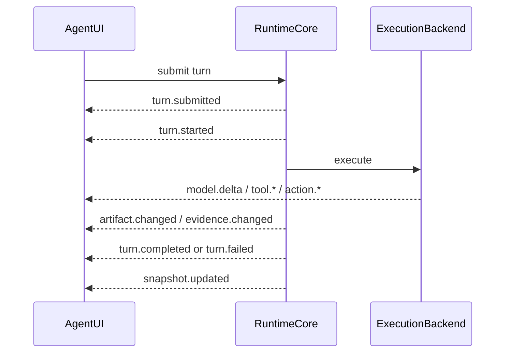

# 事件

Event 是 Runtime 与 UI 之间的最小事实单位。Lime events 不是日志文本，也不是 React state patch。

## 事件分类

| 分类 | 示例 | UI 投影 |
| --- | --- | --- |
| Lifecycle | `session.*`、`thread.*`、`turn.*`、`task.*` | Runtime status、TaskCapsule、session tabs。 |
| Model | `model.requested`、`model.delta`、`model.completed`、`model.failed` | MessageParts、streaming answer。 |
| Reasoning / plan | `reasoning.delta`、`reasoning.summary`、`run.status` | ProcessTree，不进入最终正文。 |
| Tools / process | `tool.*`、`process.*`、`output.*` | ToolGroup、inline process、timeline。 |
| Human / policy | `action.*`、`permission.*`、`sandbox.*`、`hook.*` | ActionRequired、policy controls、diagnostics。 |
| Context / history | `context.*`、`history.*`、`snapshot.updated` | context chips、hydration、repair state。 |
| Routing / limits | `routing.*`、`cost.*`、`quota.*`、`rate_limit.hit` | model chip、cost/limit summary。 |
| Artifacts / evidence | `artifact.changed`、`evidence.changed` | artifact workspace、timeline evidence、review lane。 |
| Team / background | `subagent.*`、`job.*`、`channel.*` | team roster、work board、remote teammate。 |
| Diagnostics | `runtime.warning`、`runtime.error`、metrics | diagnostics surface。 |

## 事件信封

每个 current event 至少应包含：

```json
{
  "schemaVersion": "0.1",
  "runtimeId": "runtime_local",
  "sessionId": "session_123",
  "threadId": "thread_123",
  "turnId": "turn_123",
  "eventId": "event_123",
  "sequence": 42,
  "timestamp": "2026-06-09T10:00:00.000Z",
  "type": "tool.started",
  "payload": {}
}
```

适用时还应包含 `taskId`、`runId`、`attemptId`、`stepId`、`toolCallId`、`actionId`、`artifactId`、`evidenceId`、`traceId`。

## 必需生命周期



## 降级事实

缺少 correlation id 的 event 仍可进入 diagnostics，但不能提升为标准 UI 事实。UI 应显示：

- `unknown`：事实存在但来源无法完整识别。
- `unavailable`：当前 runtime/剖面 不提供该事实。
- `blocked`：因权限、Provider readiness、host capability 或 policy 阻断。
- `stale`：hydration/read model 已过期或等待 repair。
