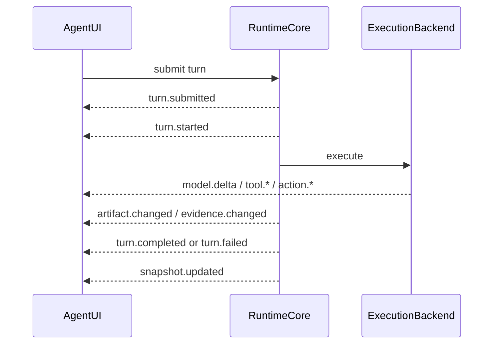

# 事件

Event 是 Runtime 与 UI 之间的最小事实单位。Lime events 不是日志文本，也不是 React state patch。

Lime 采用事件流的原因不是为了“看起来实时”，而是为了让执行过程、恢复、审查和跨 App 复用共享同一条事实链。AG-UI 的事件分类可以作为前端交互参考；进入 Lime 后，事件必须带 RuntimeCore correlation，并能被 read model 和 evidence 复用。

## 事件分类

| 分类 | 示例 | UI 投影 |
| --- | --- | --- |
| Lifecycle | `session.*`、`thread.*`、`turn.*`、`task.*` | Runtime status、TaskCapsule、session tabs。 |
| Model | `model.requested`、`model.delta`、`model.completed`、`model.failed` | UIMessageParts、streaming answer。 |
| Reasoning / plan | `reasoning.delta`、`reasoning.summary`、`run.status` | UIMessageParts reasoning part、ProcessTimeline，不进入最终正文。 |
| Tools / process | `tool.*`、`process.*`、`output.*` | ToolGroup、inline process、timeline。 |
| Human / policy | `action.*`、`permission.*`、`sandbox.*`、`hook.*` | ActionRequired、policy controls、diagnostics。 |
| Context / history | `context.*`、`history.*`、`snapshot.updated` | context chips、hydration、repair state。 |
| Routing / limits | `routing.*`、`cost.*`、`quota.*`、`rate_limit.hit` | model chip、cost/limit summary。 |
| Artifacts / evidence | `artifact.changed`、`evidence.changed` | artifact workspace、timeline evidence、review lane。 |
| Team / background | `subagent.*`、`job.*`、`channel.*` | team roster、work board、remote teammate。 |
| Diagnostics | `runtime.warning`、`runtime.error`、metrics | diagnostics surface。 |

## 生命周期详解

### Turn / Run

```text
turn.submitted
turn.started
run.status(planning)
run.status(acting)
turn.completed | turn.failed | turn.cancelled
snapshot.updated
```

`turn.*` 描述用户请求在 RuntimeCore 中的生命周期。`run.status` 描述一次执行尝试的阶段变化。一个 turn 可以有多次 attempt；重试不能覆盖原 attempt，而应进入 ExecutionGraph。

### Message

```text
model.requested
model.delta*
model.completed | model.failed
messages.snapshot?
```

`model.delta` 只能更新 UIMessageParts 的文本或可显示摘要。最终回答以 `model.completed` 或等价 final text fact 做 reconciliation，不能把 final 内容再次追加。

### Tool

```text
tool.started
tool.args*
tool.progress*
tool.result | tool.failed
output.spilled?
```

工具事件必须有 `toolCallId`。工具输出过大或敏感时，进入 output/artifact/evidence/raw ref，不进入消息正文。

### Action

```text
action.required
action.updated?
action.resolved | action.cancelled | action.expired
```

审批和结构化输入不能只存在于 React state。UI 可以乐观显示用户选择，但必须等待 RuntimeCore 或 action owner 返回 resolved 事实。

### Artifact / Evidence

```text
artifact.changed
artifact.versioned?
evidence.changed
evidence.exported?
review.verdict?
```

产物和证据是 refs。Runtime 负责记录创建关联，artifact/evidence owner 负责内容、版本、审查和导出。

## 事件信封

每个 current event 至少应包含：

```json
{
  "schemaVersion": "0.1",
  "runtimeId": "runtime_local",
  "sessionId": "session_123",
  "threadId": "thread_123",
  "turnId": "turn_123",
  "eventId": "event_123",
  "sequence": 42,
  "timestamp": "2026-06-09T10:00:00.000Z",
  "type": "tool.started",
  "payload": {}
}
```

适用时还应包含 `taskId`、`runId`、`attemptId`、`stepId`、`toolCallId`、`actionId`、`artifactId`、`evidenceId`、`traceId`。

## 必需生命周期



## 降级事实

缺少 correlation id 的 event 仍可进入 diagnostics，但不能提升为标准 UI 事实。UI 应显示：

- `unknown`：事实存在但来源无法完整识别。
- `unavailable`：当前 runtime/剖面 不提供该事实。
- `blocked`：因权限、Provider readiness、host capability 或 policy 阻断。
- `stale`：hydration/read model 已过期或等待 repair。

## 不合格事件模式

| 模式 | 问题 | 应改为 |
| --- | --- | --- |
| `assistant` 文本里写“工具完成” | 无法审查、无法恢复、无法失败分类。 | `tool.result` + output/artifact ref。 |
| 本地 UI 生成 approval id | Runtime 无法 resume。 | `action.required` 由 RuntimeCore 或 action owner 创建。 |
| 大 JSON 反复塞进 delta | 首屏慢，泄漏风险高。 | `output.spilled` + ref。 |
| 断流后继续追加文本 | 顺序不可信。 | 标记 `stale`，用 read model repair。 |
| 只有日志字符串没有 typed payload | Projection 只能猜。 | 输出 typed RuntimeEvent。 |
