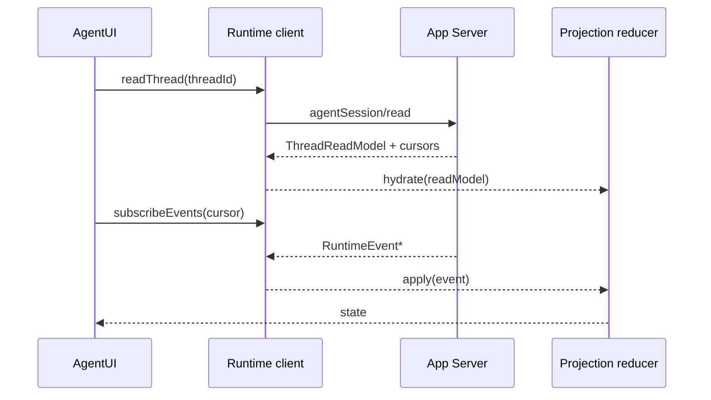

# UI 投影契约

AgentUI 投影 是 Runtime facts 与 UI components 之间的唯一 adapter layer。

Projection 的职责是把不可直接展示的 runtime facts 归一化为稳定 UI state。它不拥有 Provider、执行状态、审批结果、artifact 内容或 evidence verdict；这些都回到 App Server / RuntimeCore / 对应 owner。

## 输入

```text
RuntimeEvent
  + ThreadReadModel
  + TaskSnapshot
  + ArtifactSummary
  + EvidenceSummary
  + Diagnostics
  -> AgentUI Projection State
```

## ProjectionState

```ts
interface AgentUiProjectionState {
  runtime: RuntimeStatusView;
  messages: UIMessagePart[];
  timeline: ProcessTimelineEntry[];
  graph: ExecutionGraphNode[];
  tools: ToolCallView[];
  actions: ActionRequiredView[];
  tasks: TaskCapsuleView[];
  artifacts: ArtifactRefView[];
  evidence: EvidenceRefView[];
  diagnostics: DiagnosticView[];
  subagents: SubagentsViewModel;
  hydration: HydrationState;
  ui: LocalUiState;
}
```

`ui` 只能保存 collapse、focus、selected tab、draft input、scroll anchor 等本地状态。除 `ui` 外，所有字段都必须能从 RuntimeEvent + ReadModel 重建。

## 投影映射

| Runtime 事实 | 投影 |
| --- | --- |
| `turn.*`、`run.status` | RuntimeStatus、ProcessTimeline entries、ExecutionGraph run node。 |
| `model.delta`、`model.completed` | UIMessageParts。 |
| `reasoning.*` | UIMessageParts reasoning part、ProcessTimeline reasoning entries。 |
| `tool.*`、`process.*` | ToolGroup、ProcessTimeline entries、ExecutionGraph step/tool nodes。 |
| `action.*`、`permission.*` | ActionRequired、TaskCapsule attention。 |
| `task.*`、`queue.changed` | TaskCapsule、projection activity。 |
| `subagent.*`、`job.*`、`channel.*`、`handoff.*`、`review.*` | ExecutionGraph、`AgentUiProjectionState.subagents`、SubagentsView。 |
| `artifact.changed` | ArtifactRef、artifact workspace。 |
| `evidence.changed` | EvidenceRef、review/replay/ProcessTimeline evidence lane。 |
| `snapshot.updated` | Hydration/reconciliation。 |

## 标准投影对象

| 对象 | 用途 | 所有权 |
| --- | --- | --- |
| `UIMessageParts` | 用户和 assistant 可读消息分片，兼容 AI SDK `UIMessage.parts` 的设计方向。 | Projection owns derived state；Runtime owns source facts。 |
| `ProcessTimeline` | 按 `sequence` 展示执行过程、工具、审批、产物、证据和诊断。 | Projection owns order/read state；Runtime owns event order。 |
| `ExecutionGraph` | 表达 task、subagent、job、attempt、dependency、handoff 结构。 | RuntimeCore owns graph facts；Projection owns collapsed/focus state。 |
| `ToolGroup` | 工具调用的生命周期、参数摘要、输出引用和失败分类。 | ExecutionBackend / RuntimeCore owns tool facts。 |

## Reducer 规则

| 规则 | 要求 |
| --- | --- |
| 去重 | 按 `eventId` 幂等处理，同一事件重复到达不能重复追加文本或工具进度。 |
| 顺序 | 按 `sequence` 更新 timeline；乱序时进入 `stale`，等待 read model repair。 |
| 合并 | `model.delta` 聚合到同一 `messageId/partId`；`model.completed` 做 reconciliation。 |
| 分离 | text、reasoning、tool、action、artifact、evidence、diagnostics 分开存，不塞进同一 prose 字段。 |
| 降级 | 缺少 id 或 owner 时渲染 degraded entry，不伪造 tool/action/artifact 完成状态。 |
| 清理 | turn 完成后 active attention 可折叠，但 timeline、artifact/evidence refs 仍可回放。 |

## Hydration 流程



Hydration 不是用快照覆盖所有本地状态。快照负责恢复 runtime facts；collapse、focus、draft 等本地 UI state 保留在 `ui` 子树。

## 与 AI SDK / AG-UI 的关系

| 参考 | 采用 | Lime 扩展 |
| --- | --- | --- |
| AI SDK `UIMessage.parts` | 消息分片、reasoning/tool/artifact 以 part 形态展示。 | Tool/action/artifact/evidence 完整生命周期不由 message parts 拥有。 |
| AG-UI event stream | lifecycle、text、tool、state 分离。 | 事件进入 RuntimeCore，补齐 durable read model、evidence correlation 和 governance 分类。 |

## 投影状态禁止事项

- 保存 secret-bearing raw payload。
- 把 diagnostics 放进 conversation text。
- 把 local collapse/focus state 写回 runtime。
- 从 prose 推断 tool/action/artifact/evidence 状态。
- 在 产品应用 内 fork 一套相同 投影 model。

## 未知事实

Projection 缺事实时使用这些状态：

| 状态 | 含义 |
| --- | --- |
| `unknown` | 事件存在但字段不足。 |
| `unavailable` | 剖面 不提供该能力。 |
| `blocked` | host/Provider/policy 阻断。 |
| `stale` | hydration 或 stream 需要 repair。 |
| `not_applicable` | 当前 scope 不适用。 |
