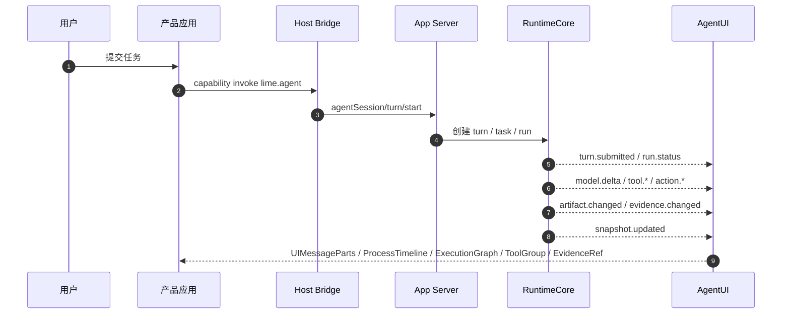

# Lime Agent Workbench 标准

Lime Agent Workbench 是 Lime 面向用户侧 Agent 应用的标准工作台：它把 AgentRuntime、AgentUI、App Server、Host、产品应用和治理规则放到同一套契约里。

它参考 AG-UI 的文档框架，但不是 AG-UI 的复制版。Lime 的现实是已经存在 App Server、RuntimeCore、ExecutionBackend、AgentUI、Desktop Host、provider store、evidence/replay/review、Content Studio 和未来 Agent Apps。Workbench 的任务是把这些系统收敛成一条可复用、可测试、可治理的主链。

```text
AgentRuntime 拥有执行事实。
AgentUI 消费执行事实并投影用户界面。
产品应用提供业务上下文和页面编排。
```

<div class="overview-diagram">
  <div class="overview-lane">
    <strong>Runtime</strong>
    <span>App Server / RuntimeCore / ExecutionBackend</span>
  </div>
  <div class="overview-arrow">→</div>
  <div class="overview-lane">
    <strong>Facts</strong>
    <span>RuntimeEvent / ThreadReadModel / TaskSnapshot</span>
  </div>
  <div class="overview-arrow">→</div>
  <div class="overview-lane">
    <strong>AgentUI</strong>
    <span>UIMessageParts / ProcessTimeline / ExecutionGraph / Evidence</span>
  </div>
  <div class="overview-arrow">→</div>
  <div class="overview-lane">
    <strong>Apps</strong>
    <span>Content Studio / Zhongcao / Agent Apps</span>
  </div>
</div>

## Agent 协议分层

Lime 不排斥外部协议，但内部标准必须服务现有代码库和治理边界。

| 层级 | 外部参考 | Lime 标准 |
| --- | --- | --- |
| Agent ↔ 用户界面 | AG-UI、assistant-ui | Lime AgentUI 投影契约。 |
| Agent ↔ Runtime 事实 | OpenAI Agents SDK、LangGraph、AI SDK streams | Lime AgentRuntime 剖面、RuntimeEvent、ThreadReadModel、TaskSnapshot。 |
| Agent ↔ 工具与数据 | MCP、tool calling schemas | App Server capability gateway、Tool inventory、Policy/Permission/Sandbox facts。 |
| Agent ↔ Agent | A2A、多代理 Runtime | RuntimeCore task/subagent/job/channel facts 与 `AgentUiProjectionState.subagents` 投影。 |
| Evidence / Replay / Review | tracing、eval、observability | Lime evidence/replay/review refs，必须能通过 runtime correlation ids join。 |

外部协议只能作为参考。只要进入 Lime 产品主链，写入边界就必须回到 App Server / RuntimeCore；UI 只能消费事实并投影。

## 基础模块

<div class="contract-grid">
  <div class="contract-card">
    <h3>Streaming conversation</h3>
    <p>模型文本流只负责回答内容；状态、工具、审批、产物和证据必须走结构化事件。</p>
  </div>
  <div class="contract-card">
    <h3>Runtime events</h3>
    <p>每个执行事实都有 eventId、sequence、scope ids、typed payload 和 refs。</p>
  </div>
  <div class="contract-card">
    <h3>Read models</h3>
    <p>SessionSnapshot、ThreadReadModel、TaskSnapshot 支撑旧会话恢复和快速首屏。</p>
  </div>
  <div class="contract-card">
    <h3>Process Projection</h3>
    <p>过程表面由 UIMessageParts、ProcessTimeline 和 ExecutionGraph 共同表达，不引入非标准组件树协议。</p>
  </div>
  <div class="contract-card">
    <h3>Tool UI</h3>
    <p>工具有独立生命周期、输出引用、失败分类和权限关联，不附着在普通消息里。</p>
  </div>
  <div class="contract-card">
    <h3>Human in the loop</h3>
    <p>审批、结构化输入、计划确认和中断恢复必须是 action facts。</p>
  </div>
  <div class="contract-card">
    <h3>Artifacts / Evidence</h3>
    <p>产物和证据是稳定 refs，可回放、可审查、可跨 App 复用。</p>
  </div>
  <div class="contract-card">
    <h3>Governance</h3>
    <p>所有路径按 current、compat、deprecated、dead 分类，防止新旧实现继续并行扩散。</p>
  </div>
</div>

## 为什么 Lime Agent Apps 需要标准

传统前后端是请求/响应：用户提交请求，服务端返回结果，前端渲染结束。Agent 应用不是这样。

用户侧 Agent 会长时间运行、流式输出、调用工具、等待审批、创建产物、导出证据、重试任务、恢复旧会话，还可能调度子代理或后台 job。如果每个产品应用都用本地 `messages`、`executionEvents`、React state 或助手正文解析来拼过程，系统会出现几个问题：

- 同一个事实在 runtime、UI、evidence、review 中各有一套版本。
- 工具成功、审批结果、artifact 类型和 evidence verdict 无法可信追踪。
- Content Studio、Zhongcao、Agent Apps 重复开发过程组件、ToolGroup、ActionRequired。
- Provider Key、Host capability、App Server DB 的所有权变得模糊。
- 旧会话无法可靠恢复，回放和审查无法复用。

Lime Agent Workbench 的标准答案是：Runtime 写事实，ReadModel 支撑恢复，AgentUI 做投影，产品应用 只提供业务上下文和页面编排。

## Lime Agent Workbench 实战链路



## 支持的集成

### 直连模型能力

| 能力 | 状态 | Lime 资源 |
| --- | --- | --- |
| 通用文本 Agent | current target | App Server runtime backend + provider store。 |
| 图片 / 视频 / 多模态能力 | staged | 通过 capability gateway 接入，不让产品应用直读 key。 |
| 本地 mock LLM | test-only | 只能作为 fixture 或测试夹具，不得进入生产主链。 |

### Agent 框架

| 框架 / Runtime | 状态 | Lime 资源 |
| --- | --- | --- |
| Lime RuntimeCore | current | `RuntimeEvent`、`ThreadReadModel`、`TaskSnapshot`。 |
| Aster / legacy execution adapter | compat cleanup | 只能委托到 ExecutionBackend，不能继续扩展业务事实。 |
| OpenAI Agents JS | reference | 参考 tracing、handoff、tool lifecycle，不直接套 SDK。 |
| LangGraph / CrewAI / LlamaIndex | reference | 参考 graph、subagent、tool routing，输出仍需归一化为 Lime facts。 |

### Agent 交互协议

| 协议 | 状态 | Lime 资源 |
| --- | --- | --- |
| AG-UI | reference | 参考事件分类与文档组织。 |
| MCP | compatible boundary | 通过 App Server capability/tool inventory 接入。 |
| A2A | future reference | 通过 subagent/job/channel facts 表达。 |

### 基础设施与部署

| 平台 | 状态 | Lime 资源 |
| --- | --- | --- |
| Electron Desktop Host | current bridge | sidecar lifecycle、Host Snapshot、IPC。 |
| App Server sidecar | current | JSON-RPC、RuntimeCore、provider store。 |
| GitHub Pages docs | current | 本站点用于标准和治理沉淀。 |

### SDKs

| SDK | 状态 | Lime 资源 |
| --- | --- | --- |
| TypeScript client | planned | App Server client + AgentUI 投影 helper。 |
| Python fixtures | planned | schema validation、fixture replay、conformance tools。 |
| Runtime schemas | current source alignment | 对齐 AgentRuntime / AgentUI 现有 schema。 |

## 快速开始

### 接入产品应用

```ts
const turn = await agentClient.startTurn({
  sessionId,
  threadId,
  input: {
    text: userText,
    businessContext,
    providerPreference,
    modelPreference
  }
});

for await (const event of agentClient.events(turn.threadId)) {
  projection.apply(event);
}
```

产品应用不传 key、不读 App Server DB、不自建 runtime truth。

### 接入 Runtime 提供方

```ts
emit({
  type: "tool.started",
  eventId,
  sequence,
  sessionId,
  threadId,
  turnId,
  stepId,
  toolCallId,
  payload: { toolName, title }
});
```

提供方输出结构化 facts，UI 只消费 facts。

### 接入 UI 表面

```ts
const state = projectRuntimeFacts({
  events,
  threadReadModel,
  taskSnapshots,
  artifactSummaries,
  evidenceSummaries
});
```

UIMessageParts、ProcessTimeline、ExecutionGraph、ToolGroup、ActionRequired、ArtifactRef、EvidenceRef 共享同一套投影状态。

## 探索 Lime Agent Workbench

- [核心架构](/concepts/architecture)
- [Runtime 事件契约](/contracts/runtime-event)
- [UI 投影契约](/contracts/ui-projection)
- [Coding 剖面](/profiles/coding)
- [Process Projection 草案](/drafts/process-projection)
- [Content Studio 接入教程](/tutorials/content-studio)

## 资源

| 资源 | 用途 |
| --- | --- |
| [Lime AgentRuntime 剖面](/profiles/lime) | Lime current runtime 的严格产品剖面。 |
| [Coding 剖面](/profiles/coding) | 编程型 Agent 工作台的工具、权限、投影和验收剖面。 |
| [Content Studio 剖面](/profiles/content-studio) | 第一个重点产品接入样板。 |
| [治理规则](/concepts/governance) | current / compat / deprecated / dead 分类。 |
| [路线图](/development/roadmap) | Workbench 标准化阶段。 |

## 贡献方式

新增或修改标准时，必须同步更新相关契约、剖面、fixture 或验收场景。不能只改散文说明。

## 支持与反馈

当前站点服务 Lime 内部标准治理。发现 AgentUI / AgentRuntime 现实实现与本文冲突时，先补充事实源和分类，再决定迁移或修正文档。
