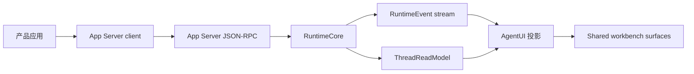

# 快速开始

先确定你在本轮接入里扮演哪个角色。

| 你正在建设 | 从这里开始 |
| --- | --- |
| 一个新的 runtime / Provider adapter | [Runtime 提供方](/quickstart/runtime-provider) |
| 一个共享 AgentUI 表面或组件 | [UI 消费方](/quickstart/ui-consumer) |
| Content Studio / Zhongcao / Agent App 这样的产品入口 | [产品应用](/quickstart/product-app) |

## 最小可用链路



## 接入前检查

1. 写出事实源声明：这个能力以后只允许向哪里收敛。
2. 标明现有实现的 `current`、`compat`、`deprecated`、`dead`。
3. 确认产品应用不传 key、不读 App Server DB、不复制 RuntimeCore。
4. 确认 UI 缺失事实时渲染 unknown/unavailable/blocked/stale。
5. 为 runtime event、read model 或投影补 schema、fixture、契约测试。

## 推荐第一刀

不要先改视觉细节。先把一个真实 turn 接到：

```text
submit turn
  -> runtime accepted
  -> stream status/text/tool/action
  -> read model hydration
  -> projection render
  -> evidence/artifact refs visible
```

只有这条链路跑通，UIMessageParts、ProcessTimeline、ExecutionGraph、ToolGroup、Evidence lane 才有稳定事实可消费。
